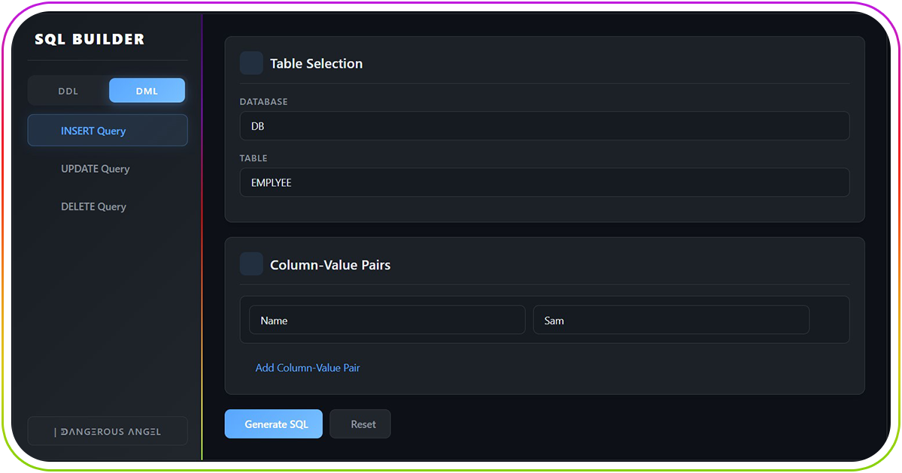

# SQL Query Builder

A simple web application for building SQL queries with a user-friendly interface.

## Queries

This application supports the generation of various SQL statement types, categorized into two main groups:

* **DDL (Data Definition Language):**
* SELECT Query
* CREATE TABLE
* ALTER TABLE
* CREATE VIEW

* **DML (Data Manipulation Language):**
* INSERT Query
* UPDATE Query
* DELETE Query

## Features

- **User-Friendly Interface**:
  - Clean, modern design with gradient colors
  - Intuitive form-based input
  - Real-time SQL generation

- **Functionality**:
  - Add/remove columns and conditions
  - Specify data types and constraints for CREATE TABLE
  - Copy generated SQL to clipboard

By [DangerousAngel](https://github.com/DangerousAngel/)
